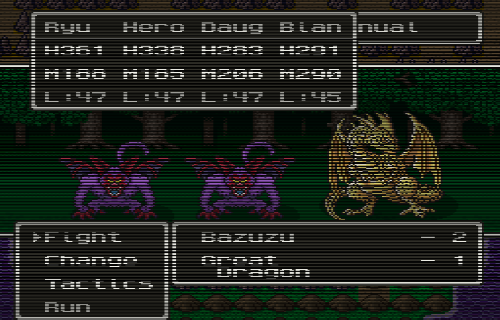
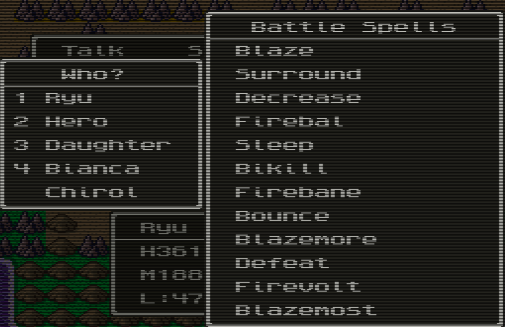

# DQ5 4-Party Members - corrected patch for the DeJap translation

A working four-member-party patch for **Dragon Quest V: Tenkuu no Hanayome**
(Super Famicom) on top of the **DeJap v2.01** English translation.

The existing conversion on Romhacking.net ([hack 7430][rhdn]) does not work: it
is misaligned by 512 bytes, so it never installs the feature and corrupts
unrelated code instead. This repository publishes a corrected patch, the
analysis behind it, and a build script that handles the ROM header for you.

[rhdn]: https://www.romhacking.net/hacks/7430/

---

## Credits

**This patch is a correction to other people's work, not original work.**

- **Mr. 45** - author of the original Japanese 4-party hack (2007), the entire
  substance of this patch. Published at
  [w.atwiki.jp/dq_binary/pages/31.html](https://w.atwiki.jp/dq_binary/pages/31.html).
  His hack is sound and applies cleanly; the bug fixed here was introduced
  downstream of him.
- **AustNerevar** - produced the first DeJap conversion and released it with
  documentation and a machine translation of the author's notes. The 512-byte
  misalignment corrected here is an easy and extremely common mistake in SNES
  romhacking, made in unpaid work on a game a lot of people wanted to play. The
  effort to bring this to an English audience is why this repository can exist
  at all.
- **DeJap Translations** (Dark Force, Neil_, Nan, and team) - the v2.01 English
  translation, 2002.

---

## No ROMs here. Bring your own.

This repository contains **patches only**. It does not, and will not, contain
any ROM image, the DeJap translation patch, or any pre-patched build. You need
to supply:

1. The unmodified Japanese ROM - `Dragon Quest V - Tenkuu no Hanayome (Japan)`
   - 1,572,864 bytes, CRC32 `BC955F3B`
   - SHA-1 `1c47ed62c561d7965fe5dc2a03f4c37feb4a46b5`
2. **DeJap's `DQ5E.IPS`**, v2.01 Final (23-FEB-2002)

---

## How to apply

> ### ⚠️ Read this or the patch will not work
>
> This patch targets the **headerless, 2 MB DeJap ROM** - CRC32 `9400CB3C`.
>
> Not the Japanese ROM. Not a headered ROM. Not a pre-patched "translated" ROM
> downloaded from a ROM site (those often have the internal header title
> overwritten, which changes the CRC and will be rejected).
>
> **Getting the header wrong is the exact bug this patch exists to fix.**

The full chain, with the CRC32 you should see at every step:

```
JP base ROM (headerless)   BC955F3B   sha1 1c47ed62c561d7965fe5dc2a03f4c37feb4a46b5
  + 512-byte header        8E637962
  + DeJap v2.01 IPS        A2E6F36A
  - header stripped        9400CB3C   <-- apply this patch to THIS
  + this patch             8FEDE6AC   <-- final, ready to play
```

Final build: 2,097,152 bytes, CRC32 `8FEDE6AC`,
SHA-1 `46320a1d5ad48ee138394f2ecaa3681e52f5f223`.

### Option A - scripted (recommended)

`build.py` runs the whole chain, verifies the CRC32 at every stage, and
**handles the 512-byte header for you** - which is the entire point, since
header handling is what broke the original release.

```
python build.py "Dragon Quest V - Tenkuu no Hanayome (Japan).sfc" DQ5E.IPS -o DQ5-4party.sfc
```

Python 3.8+, standard library only, no installs. Windows, Linux and macOS.
A headered base ROM is detected and normalised automatically. Run
`python build.py --help` for details.

### Option B - manual, with Flips

1. Add a 512-byte header to the Japanese ROM, apply `DQ5E.IPS`, then remove the
   header again. Confirm you have CRC32 `9400CB3C`.
2. Apply `dq5-4party-dejap-fixed-v1.bps` to that file with
   [Flips](https://github.com/Alcaro/Flips).
3. Confirm CRC32 `8FEDE6AC`.

**Use the BPS, not the IPS.** BPS validates the source ROM and refuses to
produce a broken build; it will tell you immediately if your DeJap ROM is not
`9400CB3C`. The IPS is provided only to match the original release's
convention - **IPS performs no validation whatsoever** and will happily apply
itself to the wrong ROM and produce a silently broken game. That absence of
validation is a direct contributor to the bug this repository fixes.

---

## What was wrong with the original

Mr. 45's patch is written against a headerless ROM. Applying it to a *headered*
ROM shifts every write 512 bytes late; diffing that result back against a
headerless ROM bakes the error into a distributable patch.

That is what happened. Measured against Mr. 45's original:

- **1140 of his 1210 changed bytes (94.2%)** appear in the released conversion
  at exactly `+0x200`, writing the same values to the wrong addresses.
- The genuine target sites are left **untouched** - the feature is never
  installed.
- ~1600 bytes of unrelated working code are overwritten.

Hence the crash: everything up to and including the config prompts runs fine,
because none of that code was hit. New-game party initialisation runs straight
into corrupted code and the CPU derails, which is why the hang is accompanied
by a stray door-open sound effect.

Full detail, including the disassembly and how the correct sites were
identified: **[docs/ANALYSIS.md](docs/ANALYSIS.md)**.

---

## It works



Four status windows, four members acting, combat resolving normally - on a ROM
built by the chain above.



## Testing status

Verified on the final build (`8FEDE6AC`), on **Mesen 2.1.1** and
**snes9x 1.62.3**:

- Clears name entry and both config prompts - the exact point where the
  original release hangs
- Reaches the Gotha birth scene
- Stats menu renders correctly
- Accepts a fourth member added from the wagon on a normal 3-member save
- **Four-member battle works** - four status windows, all four members act,
  combat resolves cleanly

Not yet tested: a full playthrough. This has not been played to completion, and
the late-game sprite issues Mr. 45 documented (below) are unresolved. Bug
reports welcome.

---

## Known issues, inherited from the original hack

These are **Mr. 45's own documented issues** with his 2007 hack. They predate
this repository, they are not caused by the alignment fix, and they are not
fixed by it:

- **The magic carpet makes Zenithian Castle disappear.** The castle uses sprite
  slot `0A`, but the carpet's shadow was assigned to `0A` as well.
- **The Zenithian Bell corrupts the ship graphics.** With a fourth member the
  sprite budget overruns: a four-member field party with the ship already uses
  `0x019A` sprites, and the dragon occupies `0180-01F8`, pushing past the SNES
  hard limit of 512. Something has to be sacrificed.

His notes, in the original Japanese and in the machine translation distributed
with the 2022 release: **[docs/known-issues.txt](docs/known-issues.txt)**.

### Deliberate omission

Six of Mr. 45's edits in bank `$04` are **intentionally not applied**. They are
stats-menu layout values - a pointer and five row counts - tuned to the
Japanese menu. DeJap rebuilt those menus for English text, so the Japanese
layout numbers do not transfer. The stats menu renders correctly without them,
because DeJap's own layout work already accommodates the fourth row. His
14-byte menu descriptor at `0x027FF0` *is* applied, since that space is free in
both ROMs.

---

## Contents

```
build.py                            one-command build, stdlib only
dq5-4party-dejap-fixed-v1.bps       the patch (preferred - validates source)
dq5-4party-dejap-fixed-v1.ips       same patch, IPS format (no validation)
docs/ANALYSIS.md                    full diagnosis of the +0x200 misalignment
docs/known-issues.txt               Mr. 45's original notes, JP + translation
screenshots/                        four-member battle and party roster
```

---

## License

See [LICENSE](LICENSE). In short: the tooling and documentation here are freely
usable, while the patch content itself derives from Mr. 45's 2007 release and is
distributed in the same spirit - freely, for people who own the game.
